# Newrex OS


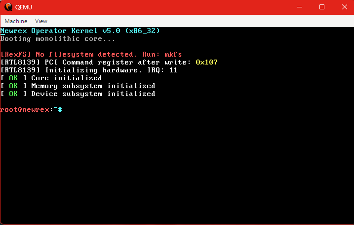

A hobby x86 operating system written from scratch in C for the x86 architecture. Newrex focuses on low-level systems programming, custom filesystem design, executable loading, memory management, and networking.

> ⚠️ Newrex is currently in **Developer Preview Beta** and is under active development.

---

# Features

## Kernel

- 32-bit x86 Monolithic Kernel
- Multiboot-compliant boot process
- GDT & IDT initialization
- Interrupt handling
- Programmable Interrupt Controller (PIC)
- Programmable Interval Timer (PIT)
- Keyboard driver
- CMOS RTC support
- Kernel tracing subsystem

---

## Memory Management

- Physical Memory Manager (PMM)
- Virtual Memory Manager (VMM)
- Identity Paging
- Dynamic Heap Allocator
- Memory Diagnostics Commands

---

## Filesystem (RexFS)

Custom filesystem developed specifically for Newrex.

### Features

- Custom Superblock
- Inode-Based Storage
- Directory Hierarchy
- Persistent File Storage
- Clean Shutdown Tracking
- Mount / Unmount Support
- File & Directory Operations

### Commands

```text
mkfs
mount
unmount
fsinfo
mkdir
cd
pwd
ls
touch
rm
write
cat
```

---

## Executable Format (NEX)

Newrex includes a custom executable format called **NEX**.

### Features

- Custom Binary Header
- Executable Validation
- Dynamic Program Loading
- Heap-Based Execution
- Safe Return To Kernel

### Commands

```text
writehex
exec
```

---

## Networking

Newrex includes a functional network stack and RTL8139 driver.

### Features

- PCI Device Enumeration
- RTL8139 Ethernet Driver
- Ethernet Layer
- ARP
- IPv4
- ICMP Echo Requests
- UDP Transport
- Basic TCP State Machine

### Commands

```text
netinfo
ping
udpsend
```

---

# Screenshots

## Boot


---

## Help Menu

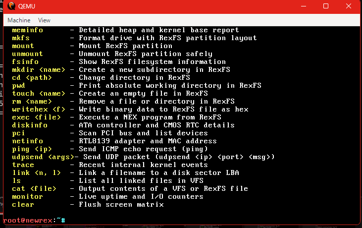

---

## System Information

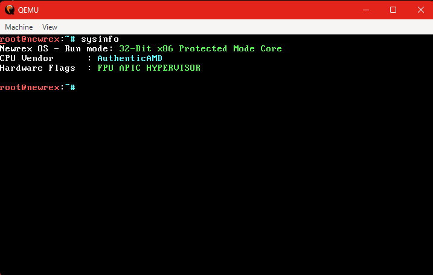

---

## Formatting RexFS

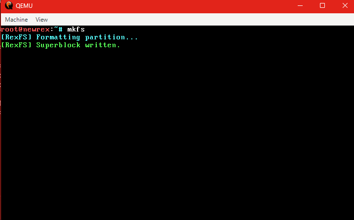

---

## Mounting RexFS

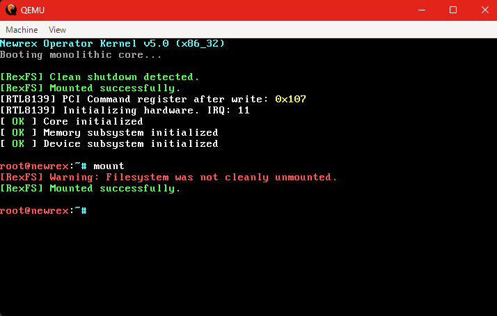

---

## Creating Directories

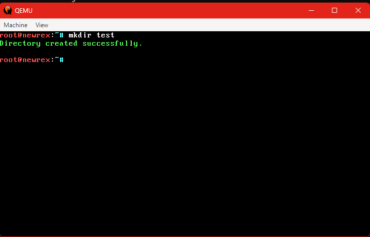

---

## Listing Files

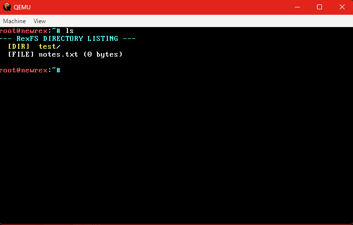

---

## Creating Files

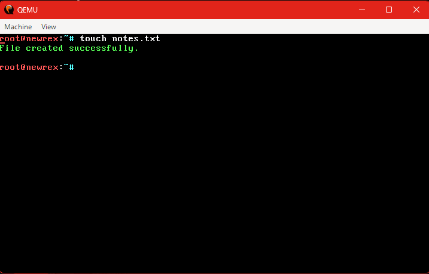

---

## Creating NEX Executables

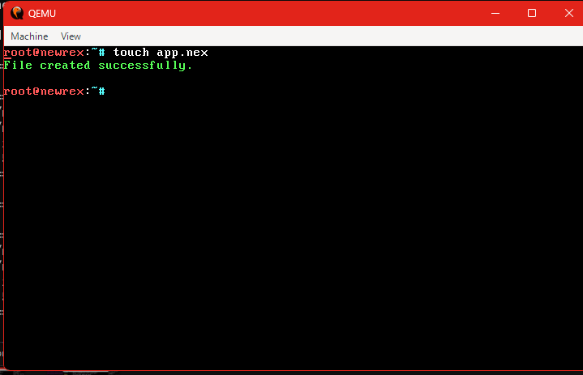

---

## Writing Binary Data

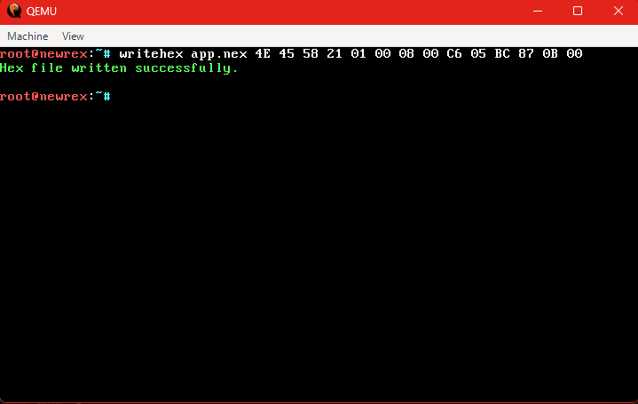

---

## Executing Programs

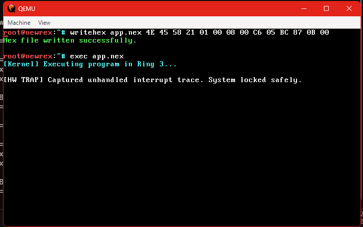

---

## Networking

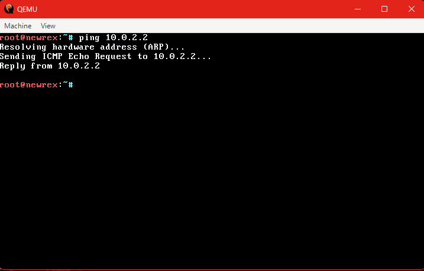

---

# Shell Commands

## System

```text
help
version
about
sysinfo
uptime
clear
monitor
```

## Memory

```text
meminfo
pmm
vmminfo
mmap
```

## Filesystem

```text
mkfs
mount
unmount
fsinfo
mkdir
cd
pwd
ls
touch
rm
write
cat
writehex
exec
```

## Networking

```text
netinfo
ping
udpsend
```

## Debug

```text
trace
diskinfo
pci
bootinfo
```

---

# Build Requirements

### Ubuntu / WSL

```bash
sudo apt update

sudo apt install \
build-essential \
nasm \
gcc \
grub-pc-bin \
xorriso \
qemu-system-x86
```

---

# Building

```bash
make -f kernel/Makefile clean all
make -f kernel/Makefile iso
```

Output:

```text
newrex.iso
```

---

# Running

Using QEMU:

```bash
qemu-system-i386 \
-cdrom newrex.iso \
-m 128M
```

Networking Example:

```bash
qemu-system-i386 \
-cdrom newrex.iso \
-m 128M \
-device rtl8139,netdev=n1 \
-netdev user,id=n1
```

---

# Example Session

```text
mkfs
mount

mkdir test
cd test

touch notes.txt
write notes.txt Hello Newrex

cat notes.txt

ping 10.0.2.2
```

---

# Current Status

## Implemented

- Bootloader
- GDT
- IDT
- PMM
- VMM Foundations
- Heap Allocator
- PCI Enumeration
- RTL8139 Driver
- ARP
- IPv4
- ICMP
- UDP
- Basic TCP
- RexFS Filesystem
- NEX Executables
- Interactive Shell

## In Progress

- Improved Scheduling
- Process Management
- System Calls

## Planned

### v0.2.0

- Ring 3 User Mode
- Syscall Interface
- User Process Isolation

### v0.3.0

- Preemptive Multitasking
- Advanced Scheduler
- Process Manager

### v0.4.0

- GUI Subsystem
- Mouse Driver
- Window Manager

### v0.5.0

- Application Framework
- Package Manager
- Networking Expansion

---

# Project Structure

```text
boot/       Bootloader
drivers/    Hardware Drivers
hal/        Hardware Abstraction Layer
kernel/     Kernel Core
mm/         Memory Management
docs/       Documentation & Screenshots
```

---

## Development Notes

Newrex is developed with a mixture of:

- Manual systems programming
- Documentation research
- AI-assisted Debugging
- Manual integration and programming

All features are tested and validated inside QEMU before release.

---

# License

This project is licensed under the MIT License.

See the LICENSE file for details.

---

# Author

**Satwik Bajpai**

GitHub: https://github.com/sxwik

---

# Acknowledgements

Special thanks to:

- OSDev Wiki
- GRUB Project
- QEMU
- NASM
- GCC
- Open Source Systems Programming Community

---

*"Building an operating system is one of the best ways to understand how computers actually work."*
